# Electronic Lab Notebook: LEGO 30585 Vehicle Assembly

## Objective

Assemble the LEGO City set 30585 vehicle using the [LEGO 30585 Parts Catalog](LEGO-30585_Parts-Catalog.md).

## Materials And Method

- The listed parts were checked against the [inventory](LEGO-30585_Parts-Catalog.md) before assembly.
- Each operation adds parts to the existing subassembly.
- Repeated-part callouts, such as `2x` and `4x`, are treated as replicated operations.

## Build Record

### Step 1: Establish the rolling chassis

Two bearing elements form the initial long, rigid base. Align their couplings at opposite ends before pressing the central plates into place.

**Element IDs:** `6387244` Bearing Element 2x2 2/3 (2x); `4210997` Plate 2x8, Dark Stone Grey.

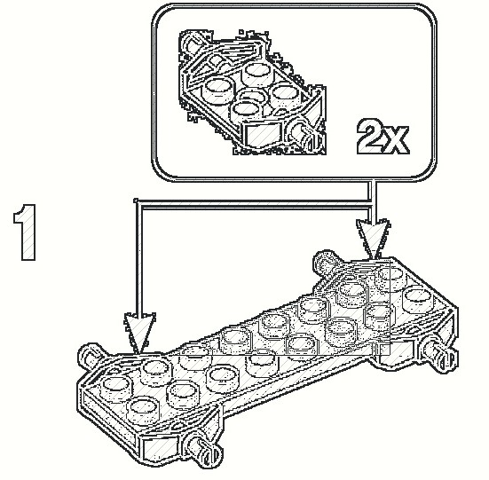

**Observation:** This is the mechanical datum for later additions; the two axle locations should remain parallel.

### Step 2: Add the red deck plates

Install the bright-red plates across the chassis to create the central deck and rear support surface.

**Element IDs:** `302021` Plate 2x4, Bright Red (2x); `4616342` Plate 4x4 with 4 Knobs, Bright Red; `371021` Plate 1x4, Bright Red.

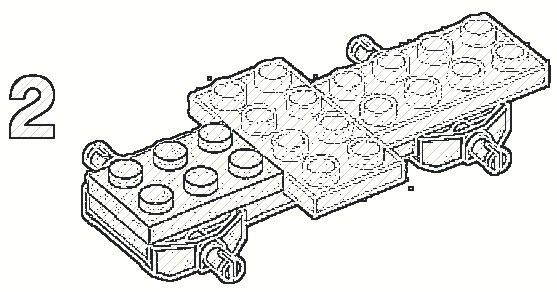

**Observation:** The red plates bridge the two chassis elements and increase torsional stiffness.

### Step 3: Form the rear section

Add the rear yellow elements and the adjoining deck components, keeping the raised yellow section at the rear of the vehicle.

**Element IDs:** `6380129` Roof Tile 1x2 Inverted, Vibrant Yellow (6x); `302021` Plate 2x4, Bright Red.

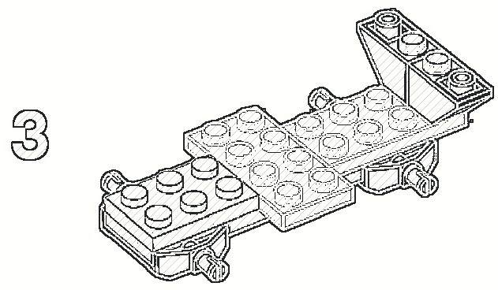

**Observation:** The chassis now has an unambiguous front-to-rear direction.

### Step 4: Build the front module

Add the front brick assembly and blue internal element. Press each component down until all studs are fully engaged.

**Element IDs:** `6024495` Brick 1x2 with 2 Knobs, Brick Yellow; `4211060` Brick 2x2, Dark Stone Grey (2x); `6251289` Flat Tile 1x2, Transparent Blue (2x).

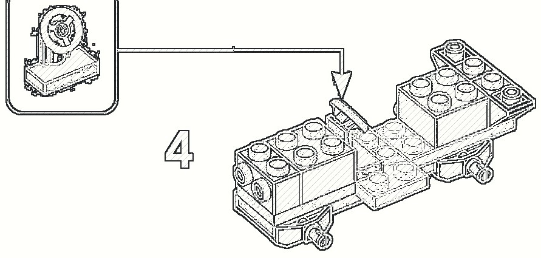

**Observation:** The forward end becomes visibly heavier and defines the nose of the vehicle.

### Step 5: Raise the central bodywork

Place the indicated grey and dark-grey components on the deck to form the central block behind the nose.

**Element IDs:** `4211060` Brick 2x2, Dark Stone Grey (2x); `6099483` Plate 1x2 with 2 Shafts, Black; `6354568` Plate 1x2 with Holder, Medium Stone Grey (2x).

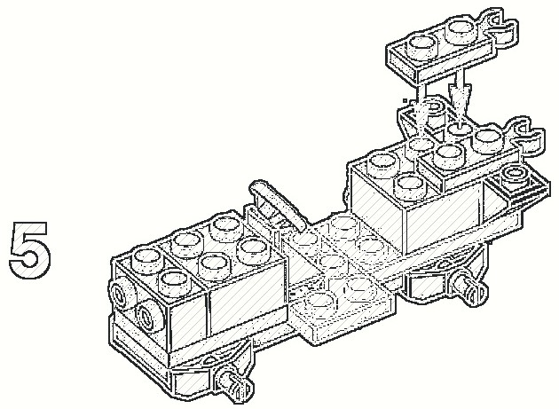

**Observation:** Check that the central block does not obstruct the axle-bearing elements beneath it.

### Step 6: Add the cockpit base

Install the rear/cockpit block and the transparent-blue component shown by the step diagram.

**Element IDs:** `6251289` Flat Tile 1x2, Transparent Blue (2x); `6053077` Plate with Bow 2x2x2/3, Black.

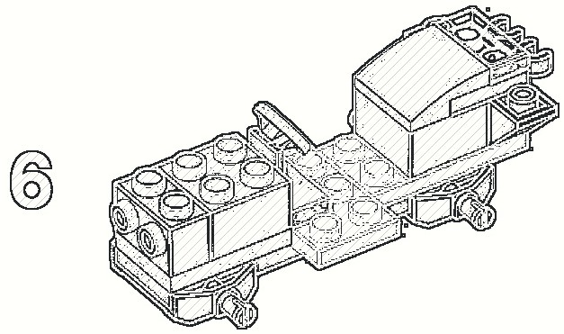

**Observation:** The model now has a defined seating volume and rear deck.

### Step 7: Fit the front grille and lamps

Complete the front face using the grille, round lamps, and lower transparent elements. Follow the inset sequence before attaching the completed front assembly.

**Element IDs:** `241226` Radiator Grille 1x2, Black; `6240030` Plate 1x1 Round, Transparent (2x); `6354568` Plate 1x2 with Holder, Medium Stone Grey (2x).

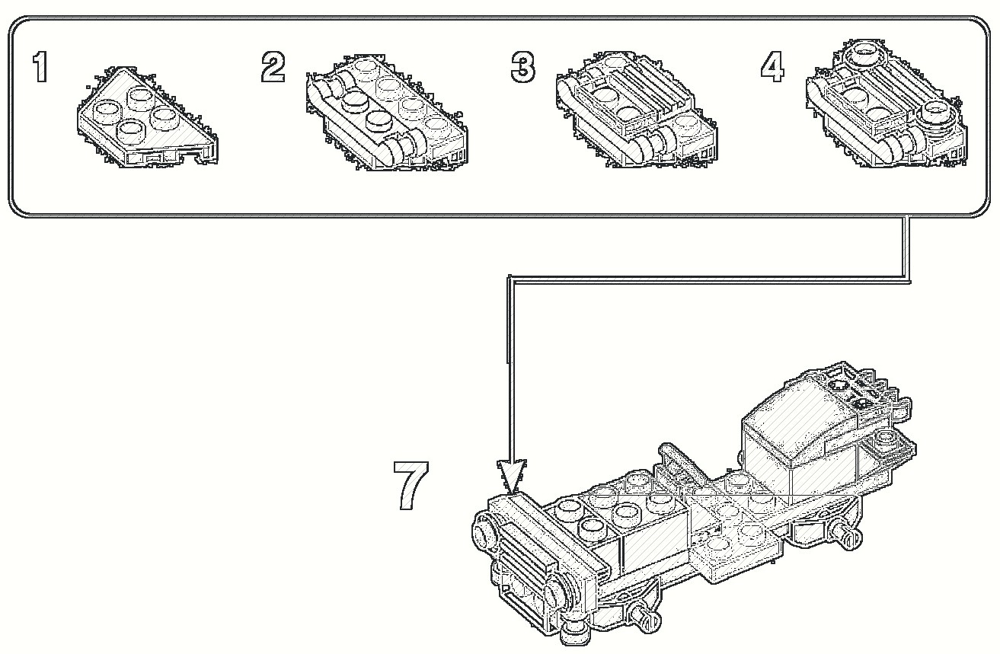

**Observation:** The front assembly is a visual alignment check: both lamps should sit at the same height.

### Step 8: Add the yellow side panels

Attach the paired yellow body panels to the left and right sides of the central structure.

**Element IDs:** `6380129` Roof Tile 1x2 Inverted, Vibrant Yellow (6x); `4527082` Plate 2x4x18 Degrees, Dark Stone Grey.

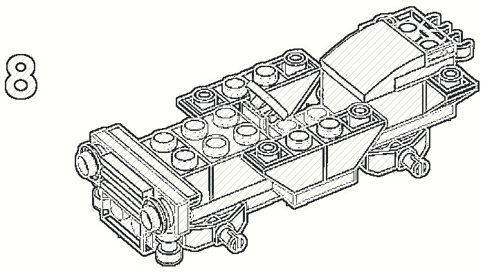

**Observation:** The side panels should be mirror-symmetric and leave the cockpit opening clear.

### Step 9: Install the red upper rails

Fit the long bright-red elements around the cockpit and along the side edges of the body.

**Element IDs:** `371021` Plate 1x4, Bright Red; `4113858` Flat Tile 1x6, Bright Red (2x); `302021` Plate 2x4, Bright Red (2x).

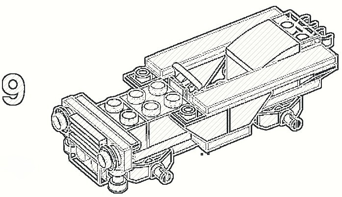

**Observation:** These rails lock the yellow side panels and establish the final body outline.

### Step 10: Complete the upper body

Close the remaining red top surfaces and confirm that the front deck and rear rails form continuous planes.

**Element IDs:** `4113858` Flat Tile 1x6, Bright Red (2x); `371021` Plate 1x4, Bright Red; `4616342` Plate 4x4 with 4 Knobs, Bright Red.

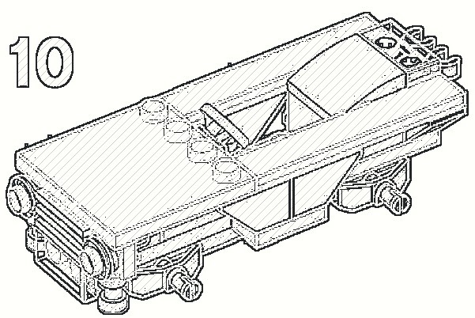

**Observation:** Before fitting the wheels, inspect all visible red plates for incomplete stud engagement.

### Step 11: Fit wheels, windscreen, and final details

Assemble the tyre-and-rim units and attach four wheels. Install the windscreen and complete the cockpit details shown in the final callout.

**Element IDs:** `4568644` Tyre Normal Wide 21x12, Black (4x); `6286850` Rim Wide with Hole 11, Black (4x); `6253682` Windscreen 2x4x2, Transparent Light Blue; `6240030` Plate 1x1 Round, Transparent (2x).

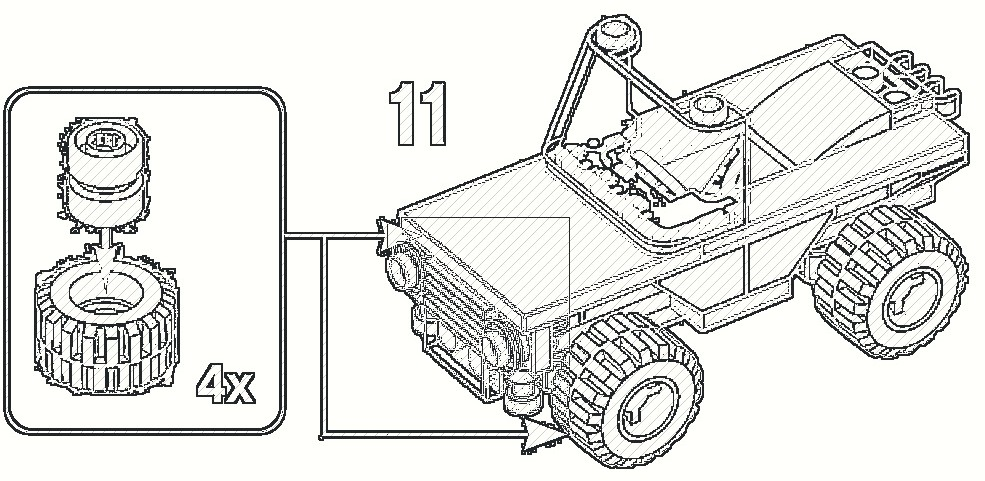

**Observation:** The completed vehicle should stand level on all four tyres. Rotate each wheel by hand to verify that no body panel interferes with it.