# LEGO 30585 Parts Catalog

**Set identifier:** `30585-1`  

## Completed Vehicle

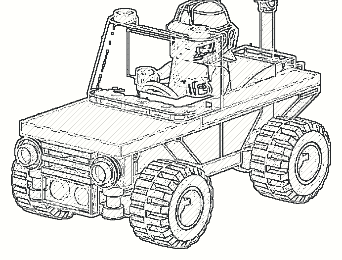

The completed vehicle is shown in the same graphite style as the catalog illustrations. It provides a visual reference for the assembled set represented by the parts list below.

## Description

This catalog documents the 26 distinct inventory elements used in LEGO set 30585. Each row is identified by its LEGO Element ID and links that identifier to the corresponding existing hand-drawn illustration, quantity, and colour. The individual PNG illustrations are lossless crops from the existing graphite-style inventory image; no part geometry or inventory value was changed during catalog creation.

The Element ID is the primary reference key for construction records, ELN entries, data files, and future publications. Quantities describe the complete set inventory rather than the quantity introduced at an individual construction step.

## Parts List

| Element ID | Hand-drawn image | Qty | Colour |
|---|---|---:|---|
| `241226` | 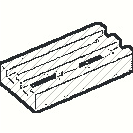 | 1 | Black |
| `302126` | 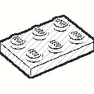 | 1 | Black |
| `4568644` | 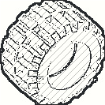 | 4 | Black |
| `6053077` | 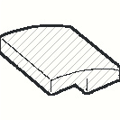 | 1 | Black |
| `6099483` | 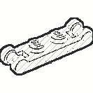 | 1 | Black |
| `6143335` | 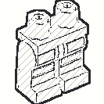 | 1 | Black |
| `6286850` | 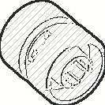 | 4 | Black |
| `6332022` | 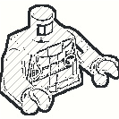 | 1 | Black |
| `6024495` | 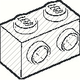 | 1 | Brick Yellow |
| `302021` | 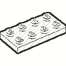 | 2 | Bright Red |
| `371021` | 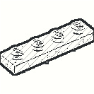 | 1 | Bright Red |
| `4113858` | 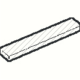 | 2 | Bright Red |
| `4616342` | 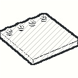 | 1 | Bright Red |
| `6223882` | 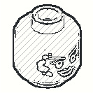 | 1 | Bright Yellow |
| `4210997` | 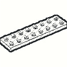 | 1 | Dark Stone Grey |
| `4211060` | 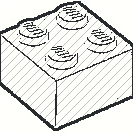 | 2 | Dark Stone Grey |
| `4527082` | 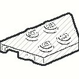 | 1 | Dark Stone Grey |
| `6354568` | 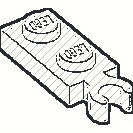 | 2 | Medium Stone Grey |
| `6248542` | 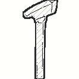 | 1 | Multicombination |
| `6380157` |  | 1 | Multicombination |
| `6387244` | 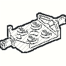 | 2 | Multicombination |
| `6240030` |  | 2 | Transparent |
| `6251289` | 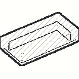 | 2 | Transparent Blue |
| `6244785` | 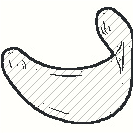 | 1 | Transparent Brown |
| `6253682` | 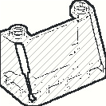 | 1 | Transparent Light Blue |
| `6380129` | 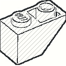 | 6 | Vibrant Yellow |

