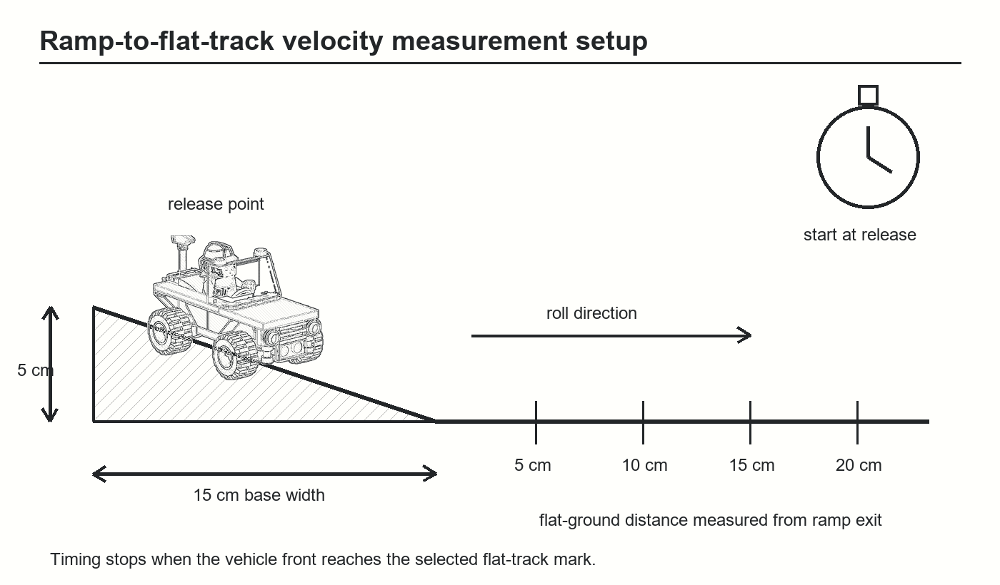
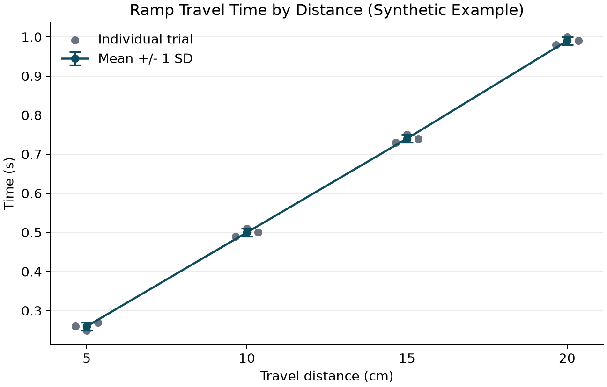
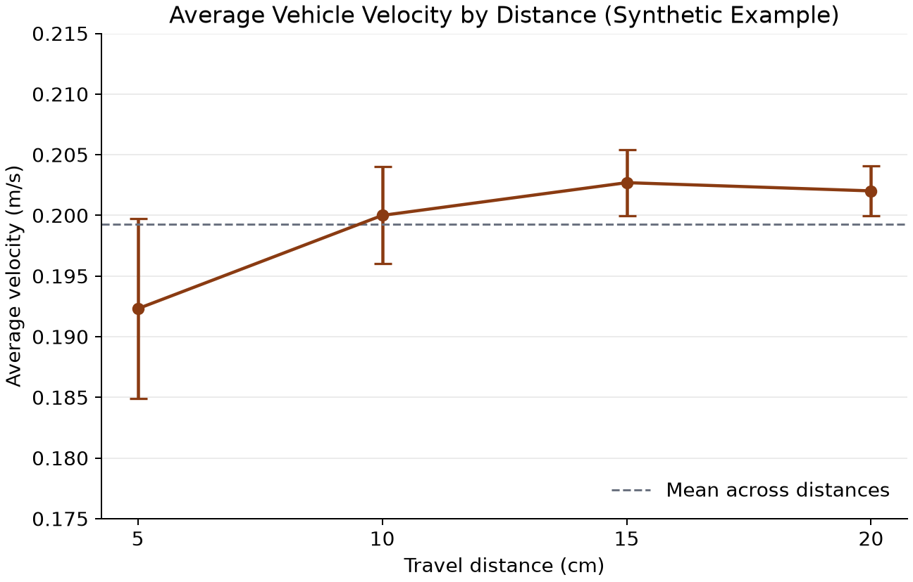

# Ramp Descent Velocity of a LEGO 30585 Vehicle: A Synthetic Demonstration

## Introduction

The motion of a wheeled vehicle on an inclined ramp provides a compact example of accelerated motion and repeatable distance-time measurement. The completed LEGO 30585 vehicle was considered as the test object. It was released at a defined marker on the ramp, and elapsed time was evaluated at successively lower markers. Average velocity was calculated from the distance travelled since release and the mean elapsed time.

This paper reports a **synthetic example dataset** prepared to demonstrate the data documentation and data publication practice. It does not report a physical measurement of the vehicle.

## Experimental Setup

The ramp had a 50 cm length and an 8 cm vertical height. Distance markers were placed at 40, 30, 20, 10, and 0 cm measured along the ramp upward from its bottom. The vehicle was released without an applied push, with its front wheels at the 40 cm marker. Stopwatch timing began at release, so `t = 0` and travelled distance was 0 cm at that marker. Timing stopped when the vehicle front reached the 30, 20, 10, or 0 cm marker, corresponding to travelled distances of 10, 20, 30, and 40 cm. Three trials were evaluated at every marker.

*Figure 1. Hand-drawn schematic of the completed LEGO vehicle on the 50 cm-long, 8 cm-high ramp. The 40 cm marker is the release position; elapsed time is recorded at the lower markers, with the 0 cm marker at the ramp end.*

For each nonzero travelled distance, the mean travel time and its sample standard deviation were calculated from three trials. Average velocity and timing-only propagated uncertainty were evaluated as

`v_bar = distance_m / mean_time_s`

`sigma_v = v_bar * sigma_t / mean_time_s`.

## Results

Mean elapsed time increased from 0.420 s after 10 cm of descent to 0.870 s at the 0 cm ramp-end marker after 40 cm of descent. The sample standard deviation was 0.010 s at all nonzero measurement points in the synthetic dataset.

*Figure 2. Individual synthetic timing trials and mean descent time. Error bars are one sample standard deviation (`n = 3`).*

The calculated average velocity increased from 0.23810 m/s after 10 cm to 0.45977 m/s at the ramp end. This increase is consistent with acceleration along the incline in the constructed example data.

*Figure 3. Average velocity as a function of distance from the release marker. Error bars represent timing-only propagated standard deviation.*

| Marker from bottom (cm) | Distance from release (cm) | Mean time (s) | Time SD (s) | Average velocity (m/s) | Velocity SD (m/s) |
|---:|---:|---:|---:|---:|---:|
| 40 | 0 | 0.000 | 0.000 | Not applicable | Not applicable |
| 30 | 10 | 0.420 | 0.010 | 0.23810 | 0.00567 |
| 20 | 20 | 0.600 | 0.010 | 0.33333 | 0.00556 |
| 10 | 30 | 0.750 | 0.010 | 0.40000 | 0.00533 |
| 0 | 40 | 0.870 | 0.010 | 0.45977 | 0.00528 |

## Conclusion

The synthetic measurements illustrate a reproducible ramp-descent analysis: repeated timing observations were collected at defined ramp markers, summarized with standard deviations, and converted to average velocities with propagated timing uncertainty. The rising average-velocity trend is consistent with the constructed accelerated-descent dataset. A physical repeat should record ramp surface composition, exact release procedure, stopwatch model, and observer reaction-time effects before making claims about vehicle dynamics.

## Data Availability

The dataset supplementing the paper is available at Zenodo under https://doi.org/10.5281/zenodo.23224090. It includes

- [Vehicle provenance](LEGO-30585_Building-Lab-Notebook.md)
- [Ramp-descent measurement ELN](LEGO-30585_Ramp-Velocity-ELN.md)
- [Raw CSV data](velocity-experiment/ramp-descent-raw-data.csv)
- [Summary CSV data](velocity-experiment/ramp-descent-summary.csv)
- [Time-plot script](velocity-experiment/ramp-time-by-distance.py)
- [Velocity-plot script](velocity-experiment/ramp-average-velocity.py)

